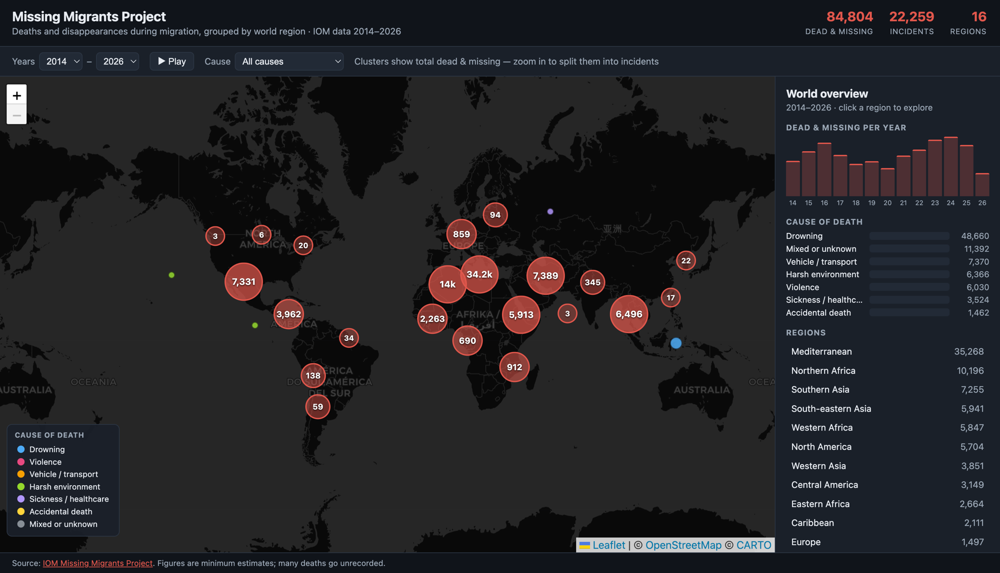

# Missing Migrants — Interactive World Map

A static website (plain HTML, CSS and JavaScript) that visualizes incidents involving
migrants — including refugees and asylum-seekers — who have died or gone missing in the
process of migration towards an international destination. Incidents are clustered on a
zoomable map at their actual locations — clusters split into individual incidents as you
zoom — with per-region statistics, cause-of-death colors and filtering, a year-range
filter, and a timeline animation.

## Data source

The data in `data/Missing_Migrants_Global_Figures_allData.csv` is obtained from the
[Missing Migrants Project](https://missingmigrants.iom.int/) by the International
Organization for Migration (IOM). Figures are minimum estimates; many deaths go
unrecorded.

## Run

Open `site/index.html` in a browser (internet access is needed for the Leaflet library
and basemap tiles), or serve it locally:

```sh
python3 -m http.server -d site 8000
# → http://localhost:8000
```

See [`site/README.md`](site/README.md) for details on features and how the data file is
generated from the CSV.

## View of the page


